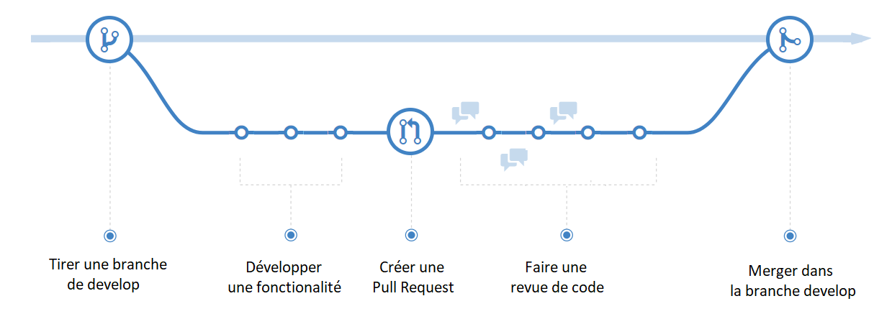
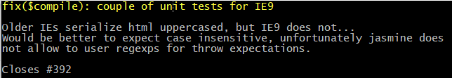

# Les bonnes pratiques Git
Comment j'utilise Git ? Mes astuces et mes bonnes pratiques !


Quand j’ai commencé à utiliser git, j’ai souvent trouvé des tutoriels pour le fonctionnement interne,
quelles étaient les différentes commandes mais rarement on me montrait quelles étaient les “bonnes pratiques”,
dans quelles situations je devais utiliser quelles commandes. C’est pourtant plus à ce genre de question
que j’aurais voulu avoir une réponse et je vais essayer ici d’y lister maintenant que j’utilise git au quotidien.

## Sommaire
* [Utilisation des branches](https://github.com/Raouf25/Git-sheet#utilisation-des-branches)
* [Les commits git](https://github.com/Raouf25/Git-sheet#les-commits-git)
* [Configuration de Git](https://github.com/Raouf25/Git-sheet#alias)
* [Alias](https://github.com/Raouf25/Git-sheet#alias)
  * [git lg](https://github.com/Raouf25/Git-sheet#git-lg)
  * [git fixup](https://github.com/Raouf25/Git-sheet#git-fixup)


  ### Utilisation des branches
  La manière dont on fonctionne est la suivante :

  1. **Branche principale partagée :**
  On a une branche principale, qui dans notre cas est master, mais qui peut différer, par exemple si vous faites du Git Flow où ce sera develop...
  Mais l'idée principale est là, on a une branche partagée, sur laquelle personne ne commit directement.

  2. **Branche par feature :**
  Ensuite depuis la branche partagée, on tire une branche personnelle. C'est notre branche à nous, on fait ce qu'on veut dessus... On peut faire des bêtises, c'est pas grave, c'est notre branche.
  Sur cette branche, on va développer nos fonctionalités, on va faire des commits... Bien formés tant qu'à faire.

  3. **Code review :**
  Et une fois satisfaits, on soumet notre code à une revue de code pour demander à l'équipe de merger cette branche, dans la branche principale. Cela peut être une Pull Request sur GitHub, une Merge Request sur Gitlab, etc.


### Les commits git
Afin **de gagner en clarté et lisibilité** sur l'historique des logs, les commits git doivent être encadrés par des conventions.

Format du message de commit:
```html
<type>(<scope>): <subject>
<BLANK LINE>
<body>
<BLANK LINE>
<footer>
```

L'en-tête du message est une seule ligne qui contient une description succincte du changement contenant un **type**, un **scope** facultative et **subject**.

les diffèrensts types de changement que ce commit fournit sont :
* **feat**: Nouvelle feature
* **fix**: Bug fix
* **docs**: Documentation, seulement les changements.
* **style**: Changement qui n'affectent pasle code (formatting, missing semi colons, …)
* **refactor**: Du code qui ne corrige ni bug, ni une feature.
* **perf**: Code qui améliore les perfermances
* **test**: Ajout d'un test manquant.
* **chore**: Change le build process outils auxiliaires.
* **build**: Les changements qui affectent le système de build ou dépendances externes ( exemple étendues: gulb, brocoli, npm).
* **ci**: Les modifications apportées aux fichiers et scripts de configuration CI ( exemple étendues: Travis, Cercle, BrowserStack, SauceLabes).


Le scope peut être quelque chose spécifiant l'endroit du changement de validation. Par exemple: $location, $browser, $compile, $rootScope, ngHref, ngClick, ngView, etc...

Le **subject** est une description très courte du changement.
* utiliser impératif: “change” ni “changed” ni “changes”
* ne capitalise pas la première lettre
* pas de point (.) à la fin

Le corps du message **body** comprend la motivation pour le changement et contraste avec le comportement précédent.


Les bogues fermés doivent être listés sur une ligne séparée dans le **footer** précédée du mot clé "Closes" comme ceci:

* Closes # 234

ou en cas de problèmes multiples:

* Closes # 123, # 245, # 992



### Configuration de Git
* Configuration du push
```bash
git config --global push.default current
```
Cela permettra de déduire la partie origine my_branch, donc vous pouvez faire:
```bash
git push
```
Ce qui créera la branche distante avec le même nom et la trackera.

### Alias
#### git lg
Afin de vous simplifier la lecture du git log, vous pouvez mettre en place cet alias :

```sh
git config --global alias.lg "log --color --graph --pretty=format:'%Cred%h%Creset -%C(yellow)%d%Creset %s %Cgreen(%cr) %C(bold blue)<%an>%Creset' --abbrev-commit"
```

Vous pouvez maintenant utiliser la commande **git lg** afin d'afficher votre journal d'historique


#### git fixup
Je veux corriger une faute de frappe dans un commit précédent après quelques nouvelles commites. L'objectif est de conserver un historique "propre" avec des commites cohérentes ajoutant des fonctionnalités.


L'opération se fait en deux étapes...
1. Première étape, on va créer un commit qui contiendra nos modifications. Un commit de fixup !C'est un commit qui fait office de "patch" du commit à modifier.
```sh
git commit --fixup A
```

2. Deuxième étape: je dois intégrer mon commit de fixup dans le commit à modifier. Pour ça, il faut réécrire l'historique.
On va alors utiliser le Rebase.
A sera donc réécrit en A'.
```sh
git rebase -i A~ --autosquash
```
NB: A représente le sha1 de commits en question.


vous pouvez mettre en place cet alias :
```sh
fixup = !sh -c 'SHA=$(git rev-parse $1) \
       && git commit --fixup $SHA \
       && git rebase -i --autosquash $SHA~' -
```

###### Exemple:
À partir de l'historique git suivant:
```sh
$ git log --oneline --decorate
d36dc2f code code code
7add401 add README
fb5b59c initial commit
```
Si vous réalisez que vous avez fait une faute de frappe dans le fichier README initial, vous pouvez corriger et modifier la validation 'add README' au lieu de créer un nouveau commit pour une faute de frappe:
```sh
$ {Correction}
$ git add .
$ git commit --fixup 7add401
```
Git a créé un commit avec un message préfixé par '! Fixup':
```sh
$ git log --oneline --decorate
7fd8071 (HEAD -> master) fixup! add README
d36dc2f code code code
7add401 add README
fb5b59c initial commit
```
Maintenant, vous pouvez réécrire l'histoire git des 3 précédents commits avec:
```sh
git rebase -i --autosquash 7add401~
```
Et le résultat
```sh
$ git log --oneline --decorate
3ec6daa (HEAD -> master) code code code
d6c4c24 add README
fb5b59c initial commit
```


avec l'alias
```sh
$ {Correction}
$ git add .
$ git fixup 7add401
```
le même résultat en une seule étape :
```sh
$ git log --oneline --decorate
3ec6daa (HEAD -> master) code code code
d6c4c24 add README
fb5b59c initial commit
```
