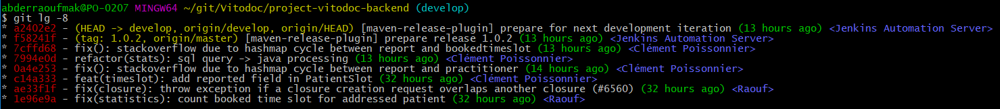

# Git-sheet
Comment j'utilise Git ? Mes astuces et mes bonnes pratiques !


Quand j’ai commencé à utiliser git, j’ai souvent trouvé des tutoriels pour le fonctionnement interne,
quelles étaient les différentes commandes mais rarement on me montrait quelles étaient les “bonnes pratiques”,
dans quelles situations je devais utiliser quelles commandes. C’est pourtant plus à ce genre de question
que j’aurais voulu avoir une réponse et je vais essayer ici d’y lister maintenant que j’utilise git au quotidien.


### Alias

Afin de vous simplifier la lecture du git log, vous pouvez mettre en place cet alias :

```sh
git config --global alias.lg "log --color --graph --pretty=format:'%Cred%h%Creset -%C(yellow)%d%Creset %s %Cgreen(%cr) %C(bold blue)<%an>%Creset' --abbrev-commit"
```

Vous pouvez maintenant utiliser la commande **git lg** afin d'afficher votre journal d'historique


